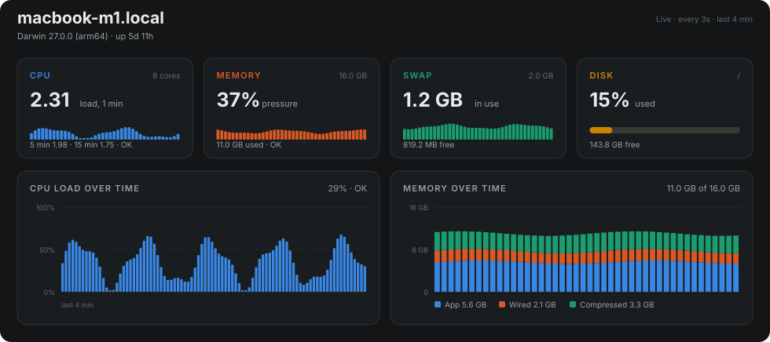
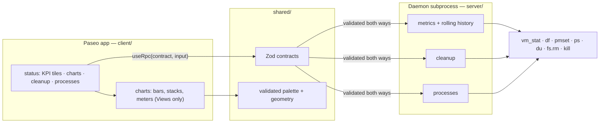

<h1 align="center">paseo-plugin-machine-status</h1>

<p align="center">
  What the machine behind your agents is actually doing, inside <a href="https://paseo.sh">Paseo</a>.<br>
  Load, memory, disk and battery; what is listening on the network and which agent started it;<br>
  Docker; and the caches and runaway processes you can clear without leaving the app.
</p>

<p align="center">
  
  
  
  
  
</p>

<p align="center">
  
</p>

<p align="center"><sub>Generated by <code>npm run preview</code> from the plugin&apos;s own palette, thresholds and chart geometry, so the picture cannot drift from the code.</sub></p>

One sidebar item, three tabs, and a pill beside the message box.

> Requires macOS. Metrics come from `vm_stat`, `sysctl`, `df`, `pmset` and
> `memory_pressure`. On any other platform the panel reports that it cannot
> collect metrics rather than showing wrong numbers.

## Install

```bash
paseo plugin add dutchakdev/paseo-plugin-machine-status
paseo plugin ls          # expect: running
```

`plugin add` tracks the default branch, so `paseo plugin update machine-status`
pulls later fixes. The plugin needs Paseo 0.8 or newer on both the daemon, which
runs its collectors, and the app, which runs its screens.

To work on it locally instead:

```bash
git clone https://github.com/dutchakdev/paseo-plugin-machine-status.git
cd paseo-plugin-machine-status
npm install
npm run typecheck && npm test
paseo plugin install "$PWD"
paseo plugin ls          # expect: running
```

Plugins must be enabled daemon-wide first, under **Settings → Plugins → Enable
plugins** (the root `pluginsEnabled` field in `~/.paseo/config.json`).

Open it from the **Machine** sidebar item, or ⌘K → "Machine status".

## The screen



**Overview** — top to bottom: a header with a live indicator and a **Pause**
control, a row of four stat tiles (CPU, memory, swap, disk) that expand into
detail when tapped, CPU-over-time and memory-over-time charts, a disk/swap/power
card, the dev-cache scanner, and the process table.

**Ports & services** — every listening socket on the left, and what is running on
the right. Only the visible tab is mounted, so the port collection does not run
while you are looking at the overview.

## The pill above the composer

The dashboard answers "what is this machine doing" when you go and ask. The pill
answers it without being asked: two percentages sitting beside the message box,
CPU load and memory pressure, its icon coloured by whichever of the two is worse.

Those are the two numbers that move while an agent works, and they fail in
different ways — one saturates, the other swaps — so both are shown. The colour
follows the worse one, because a pill has room for a single colour and you need
to know something is wrong before you need to know which one. A number that
cannot be read shows as `—` rather than as zero.

One poll every ten seconds feeds every open agent's pill at once. Paseo draws
the label, so the numbers reach each pill through its `update`; the icon is the
plugin's own and takes the warning colour when either reading turns serious.
Pressing the pill opens a compact card instead of leaving the chat: both
readings with their recent trend and their severity in words, the three
processes using the most CPU right now, and any development ports held by an
agent or by a process an agent started. **Open Machine** at the bottom leads to
the full tab. On a phone the card is a bottom sheet.

## Reading the dashboard

**CPU** shows load average, not utilisation. The bar treats one runnable thread
per core as 100%, so a sustained bar above full width means work is queueing.

**Memory** follows Activity Monitor's split rather than "free vs used":

| Row | Meaning |
| --- | ------- |
| App | Anonymous pages minus purgeable — what your programs actually hold |
| Wired | Kernel memory that cannot be paged out |
| Compressed | RAM reclaimed by compressing inactive pages |
| Cached files | File-backed pages, reclaimed automatically when needed |

The pressure figure is macOS's own, read from `memory_pressure -Q`, not a value
this plugin invents. Cached files are deliberately excluded from "Used": the
kernel gives them back on demand, so counting them as consumed is misleading.

**Thermal** reads "Not reported" on a healthy machine — macOS records a level only
once it has throttled something. That is honest rather than a failure.

**Per-core utilisation is absent** on purpose. It needs `host_processor_info`, a
native call macOS does not expose through any unprivileged shell tool, so the CPU
detail says so instead of estimating.

## History and the charts

History accumulates **as a side effect of being read** — there is no background
timer. A plugin that sampled forever would keep the machine awake in order to
report on how busy the machine is. The cost is that history only covers the time
someone was watching, which is why every chart caption reports the real span
between its first and last sample ("last 4 min") instead of claiming a fixed
window. The buffer holds 90 samples and lives in the daemon subprocess, so
closing and reopening the tab does not lose it.

React Native has no SVG, and a Paseo client bundle may import only `react`,
`react-native`, `@tanstack/react-query`, `zod` and `@getpaseo/plugin`. Every chart
here is therefore built from `View`s: lines and areas are a column per sample, and
the disk ring is a **meter**. The meter is not a consolation prize — for a single
ratio against a limit it is the better form, and a donut comparing close values is
a documented anti-pattern.

### Colour

Chrome (backgrounds, text, borders) comes from Paseo's six theme tokens. Series
colour does not: a categorical hue has to stay the same hue across themes or it
stops identifying anything. Paseo never says which theme is active, so the plugin
measures the relative luminance of `surface0` and picks the matching column.

Both columns are the reference categorical order and were checked with the
validator against their own surface — not chosen by eye:

| Check | Dark | Light |
| ----- | ---- | ----- |
| Worst adjacent CVD ΔE | 8.4 | 9.1 |
| Worst adjacent normal-vision ΔE | 19.8 | 22.9 |
| Contrast vs surface | all ≥ 3:1 | aqua and yellow under 3:1 |

The light-mode shortfall is covered by the relief rule: every series carries a
visible label and value, so nothing is identified by colour alone. Status colours
(warning, critical) are a separate fixed set and always ship beside a word —
`High`, `Critical` — never as hue on its own.

## Ports & services

### Where the port list comes from

`netstat` sees every listener on the machine; `lsof` sees only what this user may
inspect. On this machine that is 56 sockets against 39. So `netstat` defines the
list and `lsof` fills in the process — a root-owned port is reported as belonging
to another user rather than quietly dropped, and the count of those appears as a
note under the service list.

The dot beside each port is computed from the bind address, not guessed from the
port number: a wildcard bind (`*`, `0.0.0.0`, `::`) is reachable from the network,
a loopback bind is not, and a bind to one interface address is neither.

One process bound to the same port on IPv4 and IPv6 is shown once — that is one
service, and `kubectl port-forward` produces the pair every time. Sockets with no
visible owner are never merged, because without a PID there is no evidence they
belong together.

### Development ports only, by default

Most of what a Mac listens on has nothing to do with development. On this machine
the split is 30 development ports against 44 system ones: AirPlay on 5000 and
7000, Remote Desktop on 3283, Handoff, SMB, Kerberos, and a long tail of
ephemeral UDP. The list shows development ports and keeps the rest behind a
**Show system** toggle with its count — classified, never discarded.

Relevance is decided by evidence, because port ranges cannot separate these
cases: 7000 here is AirPlay, while 49165 is a coding agent.

| Rule | Result |
| ---- | ------ |
| Attributed to an agent, an agent's child, or a container | development |
| Owner not inspectable (root, another account) | system |
| Executable under `/System/`, `/usr/libexec/`, `/usr/sbin/`, `/Library/Apple/` | system |
| A known runtime — node, bun, python, kubectl, next-server, postgres, … | development |
| Anything else under `$HOME`, except `~/Library/` | development |
| Otherwise | system |

The executable path comes from `ps`, not from `lsof`, whose command column is a
bare name: the path is what separates `/System/Library/…/ControlCenter` from
`~/dev/analytics-tool/.venv/bin/python`.

### Attributing background processes to agents

Coding agents leave things running. A single `claude` agent on this machine had
three MCP servers alive under it — `@playwright/mcp`, `chrome-devtools-mcp` and
`prisma mcp` — none of which is obvious from a process list.

Matching agents by name does not work. A substring search for the providers
Paseo supports finds `AMPDeviceDiscoveryAgent`, `Campo` and `CursorUIViewService`
on a stock macOS install. The signal used instead is structural:

1. Paseo starts each agent as a **direct child of the daemon**, and the plugin's
   own parent *is* the daemon — so `process.ppid` gives the root for free.
2. Each daemon child is confirmed against `paseo.agents.list()`: the binary must
   match the provider **as a whole word**, and the process's `cwd` (read through
   `lsof -d cwd`) must match the agent's. Anything else under the daemon —
   `esbuild`, Paseo's helpers, this plugin — is left out.
3. `cwd` also tells two agents of the same provider apart, which is the ordinary
   case when the same model runs in two workspaces.
4. Everything below a confirmed agent is its background process.
5. A listening socket is attributed by walking its owner's parents until an agent
   root appears — so a dev server three levels down still names the agent that
   started it.

If `paseo.agents.list()` is unavailable or changes shape, the panel says
attribution is off and still lists the ports. It never falls back to guessing by
name.

## Docker

The third tab manages the container engine and what runs on it.

**The engine itself.** The card at the top separates three states, because they
need different offers: running shows the server version and a guarded `Quit`,
stopped shows a **Start** button, and missing says which app to install and shows
no button at all. Starting is a launch rather than a daemon command — Docker
Desktop brings up its own VM over tens of seconds — so the panel polls every 3
seconds instead of 10 until the daemon answers.

**Containers.** Right-click any row for logs, `Open http://127.0.0.1:<port>` for
each published port, restart, stop, start and remove. Destructive actions confirm
in a second menu.

**Disk.** `docker system df` broken out by images, containers, volumes and build
cache, each with what it reclaims. Two prune actions are offered and both are
narrow on purpose:

- stopped containers
- **dangling** images only, never `-a`, which would delete every image without a
  running container and cost gigabytes of re-pulling

Volumes are never offered. They are usually the largest reclaimable number on a
development machine and they hold container data, so the panel labels that number
`but this is container data` and gives it no button.

## Quick actions

Both actions are two-step. The first press states what will happen and what it
costs; the second carries it out. An armed button disarms itself after six
seconds so it cannot be triggered later by a stray tap.

### Dev caches

Scanning walks the directories with `du`, so it runs only when asked. Every
candidate is a cache its own tool recreates; clearing one costs a re-download or a
rebuild, never data.

| Target | Path | Cost of clearing |
| ------ | ---- | ---------------- |
| npm cache | `~/.npm/_cacache` | Re-download on next install |
| pnpm store | `~/Library/pnpm/store` | Rebuilt on next install |
| Yarn cache | `~/Library/Caches/Yarn` | Re-download on next install |
| Bun install cache | `~/.bun/install/cache` | Re-download on next install |
| Turbo cache | `~/.cache/turbo` | Next run rebuilds instead of replaying |
| Xcode DerivedData | `~/Library/Developer/Xcode/DerivedData` | Next build is a full rebuild |
| Cargo registry cache | `~/.cargo/registry/cache` | Re-download on next build |
| Go build cache | `~/Library/Caches/go-build` | Next build is a full rebuild |
| pip cache | `~/Library/Caches/pip` | Re-download on next install |
| uv cache | `~/.cache/uv` | Re-download on next sync |

`~/Library/Caches` as a whole is deliberately absent: it also holds application
state that does not regenerate.

Three guards stand between the plugin and `fs.rm`:

1. Only paths in the table above can ever be touched — the plugin takes a target
   id, never a path from the client.
2. Each path is resolved through `realpath` and must land at least two levels
   below the real home directory. A symlink planted inside a cache cannot
   redirect the deletion outside it.
3. Only the directory's contents are removed; the directory itself stays, because
   several tools expect it to exist.

### Top processes

The list refreshes every five seconds and pauses while a process is selected — a
list that reorders under your finger is how the wrong PID gets terminated. Each
row carries a CPU bar scaled to the heaviest process on screen.

Paseo and its parent processes are greyed out and marked `protected`. The plugin
walks its own parent chain to build that set and recomputes it from a fresh `ps`
on every kill, so a stale or forged PID from the client cannot get through.

SIGTERM is sent first and the result is reported honestly: a process that ignores
it is reported as still running, and force kill becomes a separate, separately
confirmed step.

## Development

```bash
npm run typecheck
npm test                              # 237 tests
paseo plugin reload machine-status    # source edits need an explicit reload
paseo plugin logs machine-status
npm run preview                       # regenerates docs/preview.svg from the real palette
```

Tests cover the command-output parsers against captured real output, the path and
PID guards, the rolling history buffer, the palette and chart geometry, the
port parsers against captured `netstat`/`lsof`/`docker` output, the agent-matching
rules including the real false positives above, and a
round-trip of every handler result through its own Zod contract — the drift that
would otherwise surface as an RPC rejection at runtime. The live tests never
mutate anything: cleanup is only planned, and the kill tests assert refusals,
including a refusal to terminate the test runner itself.

The SDK is a development dependency pinned to the Paseo version the plugin
targets, for typechecking and tests. Paseo supplies the runtime instances, so
none of it ships with the plugin.

## Troubleshooting

| Symptom | Check |
| ------- | ----- |
| Sidebar item missing | `paseo plugin ls` reports `running`, and the client is on this host |
| "Metrics unavailable" | The daemon is not on macOS, or a `/usr/bin` tool is missing |
| Charts look empty | History starts empty; it fills as the tab stays open |
| A port shows "another user" | It belongs to root or another account; `lsof` cannot inspect it unprivileged |
| No agent attribution | `paseo.agents.list()` failed — the note under the service list says so |
| A port you expected is missing | It was classified as a system port; use **Show system** |
| Docker containers missing | Docker is not installed or not running; the note says so |
| A cache shows "not present" | The tool is not installed, or it moved its cache |
| Edits do not appear | `npm run typecheck`, then `paseo plugin reload machine-status` |

## License

MIT
